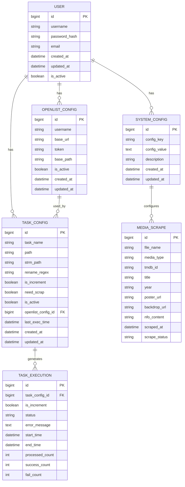
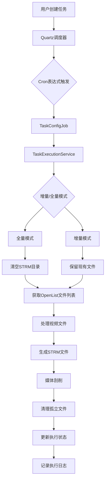
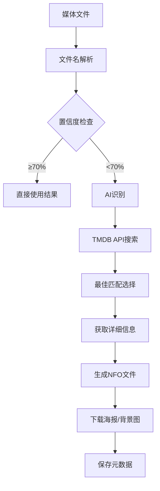
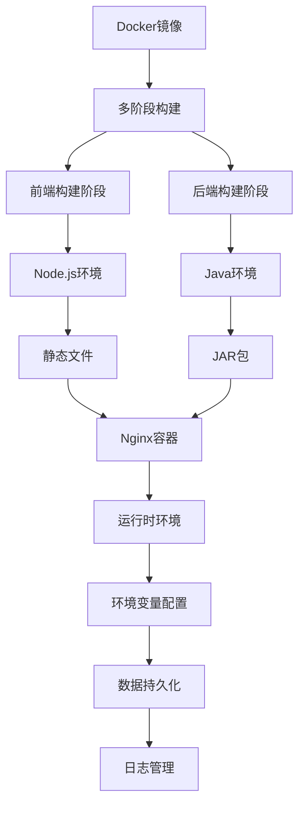

# 系统架构 - OpenList to Stream

## 整体架构

### 架构模式
- **前后端分离架构**：前端Nuxt.js + 后端Spring Boot，通过RESTful API通信
- **微服务化准备**：模块化设计，为未来微服务化奠定基础
- **容器化部署**：Docker多阶段构建，单容器部署
- **数据持久化**：SQLite数据库存储配置信息，Flyway进行数据库迁移

### 核心组件关系

```
┌─────────────────────────────────────────────────────────────┐
│                    前端层 (Frontend)                        │
│  ┌─────────────┐  ┌─────────────┐  ┌─────────────┐        │
│  │   Nuxt.js   │  │   Vue 3     │  │   Tailwind  │        │
│  │   + SSR     │  │   + Composition │   + CSS     │        │
│  └─────────────┘  └─────────────┘  └─────────────┘        │
└─────────────────────────────────────────────────────────────┘
                              │
                              ▼
┌─────────────────────────────────────────────────────────────┐
│                   API 网关层 (Gateway)                      │
│  ┌─────────────┐  ┌─────────────┐  ┌─────────────┐        │
│  │   Nginx    │  │   反向代理  │  │   负载均衡  │        │
│  │   + SSL     │  │   + WebSocket│  │   + 缓存    │        │
│  └─────────────┘  └─────────────┘  └─────────────┘        │
└─────────────────────────────────────────────────────────────┘
                              │
                              ▼
┌─────────────────────────────────────────────────────────────┐
│                   后端服务层 (Backend)                      │
│  ┌─────────────┐  ┌─────────────┐  ┌─────────────┐        │
│  │Spring Boot  │  │Spring MVC   │  │Spring Security│      │
│  │   + REST    │  │   + 数据验证│  │   + JWT     │        │
│  └─────────────┘  └─────────────┘  └─────────────┘        │
│                                                             │
│  ┌─────────────┐  ┌─────────────┐  ┌─────────────┐        │
│  │  MyBatis    │  │   Quartz    │  │   SQLite    │        │
│  │   + ORM     │  │   + 调度    │  │   + 数据库  │        │
│  └─────────────┘  └─────────────┘  └─────────────┘        │
└─────────────────────────────────────────────────────────────┘
                              │
                              ▼
┌─────────────────────────────────────────────────────────────┐
│                   外部服务层 (External)                      │
│  ┌─────────────┐  ┌─────────────┐  ┌─────────────┐        │
│  │   TMDB API  │  │   OpenList  │  │   AI 服务   │        │
│  │   + 媒体    │  │   + 文件    │  │   + 识别    │        │
│  │   + 刮削    │  │   + 列表    │  │   + 元数据  │        │
│  └─────────────┘  └─────────────┘  └─────────────┘        │
└─────────────────────────────────────────────────────────────┘
```

## 详细架构设计

### 1. 前端架构

#### 技术栈
- **框架**：Nuxt.js 3.17.7 (Vue 3 + Composition API)
- **样式**：Tailwind CSS + 自定义CSS组件
- **状态管理**：Pinia
- **构建工具**：Vite
- **运行时**：Node.js 20

#### 组件结构
```
frontend/
├── components/
│   ├── AppHeader.vue          # 顶部导航栏组件
│   ├── TaskManagement.vue     # 任务管理组件
│   ├── ConfigManagement.vue   # 配置管理组件
│   └── UI Components/         # 通用UI组件
├── pages/
│   ├── index.vue              # 首页（配置管理）
│   ├── task-management/       # 任务管理页面
│   ├── login.vue              # 登录页面
│   └── settings.vue          # 设置页面
├── stores/
│   ├── auth.js               # 认证状态管理
│   └── config.js             # 配置状态管理
├── utils/
│   ├── api.js                # API调用工具
│   ├── logger.js             # 日志工具
│   └── token.js              # Token验证工具
└── nuxt.config.ts            # Nuxt.js配置
```

#### 关键特性
- **SSR/SSG支持**：Nuxt.js提供服务端渲染和静态生成
- **响应式设计**：完美适配桌面端和移动端
- **实时通信**：WebSocket支持实时任务状态更新
- **路由管理**：基于文件系统的路由配置

### 2. 后端架构

#### 技术栈
- **框架**：Spring Boot 3.3.9
- **数据访问**：MyBatis + MyBatis-Plus
- **任务调度**：Quartz Scheduler
- **数据库**：SQLite 3.47.1
- **数据库迁移**：Flyway
- **构建工具**：Gradle 8.14.3
- **运行时**：JDK 21

#### 服务架构
```
backend/src/main/java/com/hienao/openlist2strm/
├── controller/
│   ├── TaskConfigController.java     # 任务配置管理API
│   ├── OpenlistConfigController.java # OpenList配置管理API
│   ├── AuthController.java          # 认证相关API
│   └── SystemConfigController.java   # 系统配置API
├── service/
│   ├── TaskConfigService.java        # 任务配置业务逻辑
│   ├── StrmFileService.java          # STRM文件生成服务
│   ├── OpenlistApiService.java       # OpenList API调用服务
│   ├── MediaScrapingService.java     # 媒体刮削服务
│   ├── TaskExecutionService.java     # 任务执行服务
│   ├── TmdbApiService.java           # TMDB API调用服务
│   └── AiFileNameRecognitionService.java # AI文件名识别服务
├── entity/
│   ├── TaskConfig.java               # 任务配置实体
│   ├── OpenlistConfig.java          # OpenList配置实体
│   └── SystemConfig.java            # 系统配置实体
├── dto/
│   ├── media/                        # 媒体相关DTO
│   ├── tmdb/                         # TMDB相关DTO
│   └── response/                     # 响应DTO
├── job/
│   ├── TaskConfigJob.java            # 任务调度Job
│   └── DataBackupJob.java           # 数据备份Job
├── config/
│   ├── QuartzConfig.java            # Quartz配置
│   ├── SecurityConfig.java          # 安全配置
│   └── WebConfig.java               # Web配置
├── util/
│   ├── MediaFileParser.java         # 媒体文件解析工具
│   ├── FileUtil.java                # 文件操作工具
│   └── DateUtil.java                # 日期处理工具
└── exception/
    ├── BusinessException.java        # 业务异常
    └── GlobalExceptionHandler.java   # 全局异常处理
```

#### 关键特性
- **RESTful API**：标准化的RESTful API设计
- **异步处理**：基于线程池的异步任务处理
- **内存优化**：分批处理策略，支持大规模文件处理
- **安全认证**：JWT令牌认证，Spring Security集成

### 3. 数据库架构

#### 数据库设计


#### 数据库特性
- **轻量级**：SQLite数据库，简化部署和维护
- **版本控制**：Flyway数据库迁移，确保版本一致性
- **索引优化**：合理设计索引，提高查询性能
- **数据完整性**：外键约束确保数据一致性

### 4. 任务调度架构

#### 调度流程


#### 调度特性
- **灵活调度**：支持Cron表达式的复杂调度规则
- **异步执行**：基于线程池的异步任务执行
- **错误恢复**：任务失败自动重试机制
- **状态监控**：实时任务状态监控和日志记录

### 5. 媒体刮削架构

#### 刮削流程


#### 刮削特性
- **智能识别**：结合正则表达式和AI技术提高识别准确率
- **增量刮削**：支持增量更新，避免重复刮削
- **多格式支持**：支持电影、电视剧等多种媒体类型
- **配置灵活**：可配置刮削选项和行为

### 6. 部署架构

#### 容器化部署


#### 部署特性
- **单容器部署**：前后端集成在单个Docker容器中
- **环境隔离**：Docker容器确保环境一致性
- **数据持久化**：挂载卷确保数据持久化
- **健康检查**：容器健康检查和自动重启

## 技术决策

### 架构决策
1. **前后端分离**：选择Nuxt.js + Spring Boot分离架构，提高可维护性和扩展性
2. **SQLite数据库**：选择SQLite而非MySQL/PostgreSQL，简化部署和维护
3. **容器化部署**：选择Docker容器化部署，确保环境一致性和简化运维
4. **异步任务处理**：选择Quartz + 线程池的组合，支持高并发任务处理

### 性能决策
1. **内存优化**：实现分批处理策略，降低内存占用
2. **缓存机制**：增加缓存层，减少重复API调用
3. **异步处理**：优化任务执行流程，提高并发处理能力
4. **数据库优化**：优化SQLite数据库查询性能

### 安全决策
1. **JWT认证**：选择JWT令牌认证，无状态认证机制
2. **输入验证**：实现严格的输入验证，防止SQL注入和XSS攻击
3. **HTTPS支持**：启用HTTPS加密传输，确保数据安全
4. **权限控制**：实现基于角色的访问控制，确保系统安全

## 扩展性设计

### 水平扩展
- **服务拆分**：未来可拆分为独立的微服务
- **负载均衡**：支持Nginx负载均衡和多实例部署
- **数据库集群**：支持SQLite集群或迁移到PostgreSQL

### 垂直扩展
- **插件系统**：设计可扩展的插件架构，支持第三方扩展
- **API扩展**：完善RESTful API设计，支持第三方集成
- **格式支持**：扩展支持更多文件列表格式

### 监控和运维
- **日志系统**：完善的日志记录和分析功能
- **监控告警**：实现任务执行状态监控和异常告警
- **健康检查**：系统健康检查和自动恢复机制