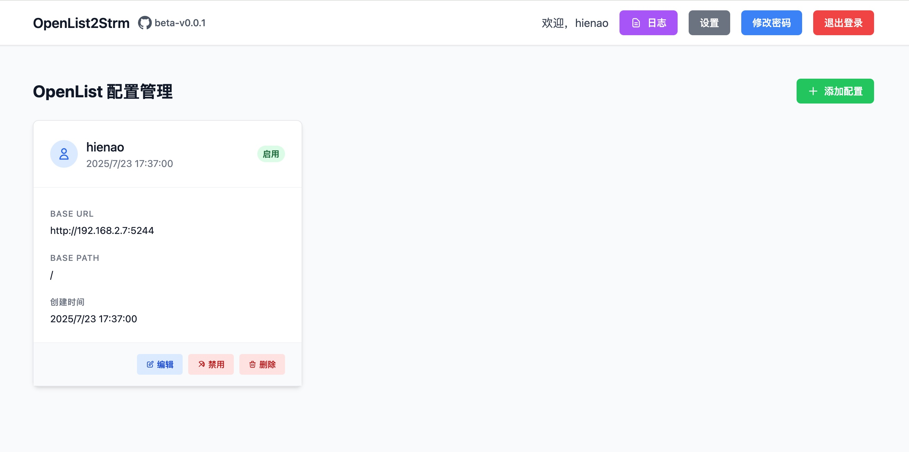

# OpenList to Stream

**一个用于将 OpenList 文件列表转换为 STRM 流媒体文件的全栈应用**

[](LICENSE)
[](https://github.com/hienao/openlist-strm/stargazers)
[](https://github.com/hienao/openlist-strm/network/members)
[](https://github.com/hienao/openlist-strm/graphs/contributors)
[](https://github.com/hienao/openlist-strm/issues)
[](https://hub.docker.com/r/hienao6/openlist-strm)

[快速部署](#快速部署) • [功能介绍](#功能介绍) • [使用说明](#使用说明) • [常见问题](#常见问题)

## 功能介绍

- 🎬 **STRM 文件生成**: 自动将 OpenList 文件列表转换为 STRM 流媒体文件
- 📋 **任务管理**: 支持创建、编辑和删除转换任务，Web 界面操作
- ⏰ **定时执行**: 基于 Cron 表达式的定时任务调度
- 🔄 **增量更新**: 支持增量和全量两种更新模式
- 🔍 **AI刮削**: 支持根据文件名、文件路径等信息，可配置AI进行媒体刮削
- 🔐 **用户认证**: 基于 JWT 的安全认证系统
- 🐳 **容器化部署**: 完整的 Docker 支持，一键部署

## 首页截图



## 快速部署

### Docker 运行（推荐）

```bash
docker run -d \
  --name openlist-strm \
  -p 3111:80 \
  -v ./config:/app/data/config \
  -v ./logs:/app/data/log \
  -v ./strm:/app/backend/strm \
  --restart always \
  hienao6/openlist-strm:latest
```

### Docker Compose 部署

创建 `docker-compose.yml`：
```yaml
services:
  app:
    image: hienao6/openlist-strm:latest
    container_name: openlist-strm
    ports:
      - "3111:80"
    volumes:
      - ./config:/app/data/config    # 配置文件和数据库存储
      - ./logs:/app/data/log         # 日志文件存储
      - ./strm:/app/backend/strm     # STRM 文件输出目录
    restart: always
```

启动服务：
```bash
docker-compose up -d
```

### 从源码构建

```bash
git clone https://github.com/hienao/openlist-strm.git
cd openlist-strm
docker-compose up -d
```

访问应用：http://localhost:3111

**目录说明：**
- `./config` → `/app/data/config` - 存储应用配置文件和 SQLite 数据库
- `./logs` → `/app/data/log` - 存储应用运行日志
- `./strm` → `/app/backend/strm` - 存储生成的 STRM 流媒体文件（核心输出目录）

## 使用说明

详细的使用说明请参考：[首次使用指南](https://github.com/hienao/openlist-strm/wiki/%E9%A6%96%E6%AC%A1%E4%BD%BF%E7%94%A8)

## 常见问题

**Q: 如何设置定时任务？**
A: 在任务配置中使用 Cron 表达式，例如：
- `0 2 * * *` - 每天凌晨2点执行
- `0 */6 * * *` - 每6小时执行一次

**Q: 增量更新和全量更新的区别？**
A: 增量更新只处理变化的文件，速度快；全量更新重新处理所有文件，确保完整性。

**Q: STRM 文件输出到哪里？**
A: 输出到容器的 `/app/backend/strm` 目录，对应宿主机的 `./strm` 目录。

## 技术栈

- **前端**: Nuxt.js 3 + Vue 3 + Tailwind CSS
- **后端**: Spring Boot 3 + MyBatis + Quartz
- **数据库**: SQLite
- **部署**: Docker + Nginx

## 开发文档

- 📖 [前端开发文档](frontend-dev.md) - Nuxt.js 前端开发指南
- 📖 [后端开发文档](backend-dev.md) - Spring Boot 后端开发指南

## 📋 更新日志

### v1.0.8 (2025-08-16)
#### ✨ 新功能
- 优化刮削逻辑，添加正则匹配，减少AI token消耗
- 添加刮削设置，优先获取openlist中已存在的刮削信息和字幕信息
- UI改版

### v1.0.7 (2025-08-04)
#### ✨ 新功能
- 手动执行时支持增量全量执行
- AI识别文件刮削优化
- 优化容器内存占用
- TMDB API 支持设置代理访问


### v1.0.1 (2025-07-30)
🎉 **项目首次发布**
#### ✨ 新功能
- 🎬 **STRM 文件生成**: 支持将 OpenList 文件列表转换为 STRM 流媒体文件
- 📋 **任务管理系统**: 完整的任务创建、编辑、删除功能
- ⏰ **定时任务调度**: 基于 Cron 表达式的自动化执行
- 🔄 **双模式更新**: 支持增量更新和全量更新两种模式
- 🔐 **用户认证**: 基于 JWT 的安全认证机制
- 🌐 **Web 界面**: 基于 Nuxt.js 3 + Vue 3 的现代化前端界面
- 🐳 **容器化部署**: 完整的 Docker 和 Docker Compose 支持

#### 🛠️ 技术栈
- **前端**: Nuxt.js 3, Vue 3, Tailwind CSS
- **后端**: Spring Boot 3, MyBatis, Quartz Scheduler
- **数据库**: SQLite
- **部署**: Docker, Nginx

#### 📦 部署方式
- Docker 单容器部署
- Docker Compose 编排部署
- 源码构建部署

---

查看完整的版本历史：[Releases](https://github.com/hienao/openlist-strm/releases)

## 项目统计

### ⭐ Star 历史

[](https://star-history.com/#hienao/openlist-strm&Date)

## 许可证

本项目采用 [GNU General Public License v3.0](LICENSE) 许可证。

### 许可证摘要

- ✅ 商业使用、修改、分发、专利使用、私人使用
- ⚠️ 衍生作品必须使用相同许可证
- ⚠️ 必须包含许可证和版权声明
- ⚠️ 必须说明更改内容
- ❌ 不提供责任和保证

---

如有问题或建议，欢迎提交 [Issue](https://github.com/hienao/openlist-strm/issues)。